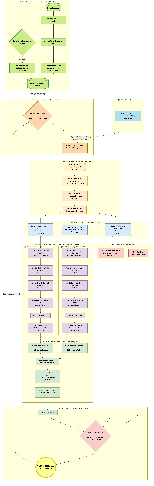
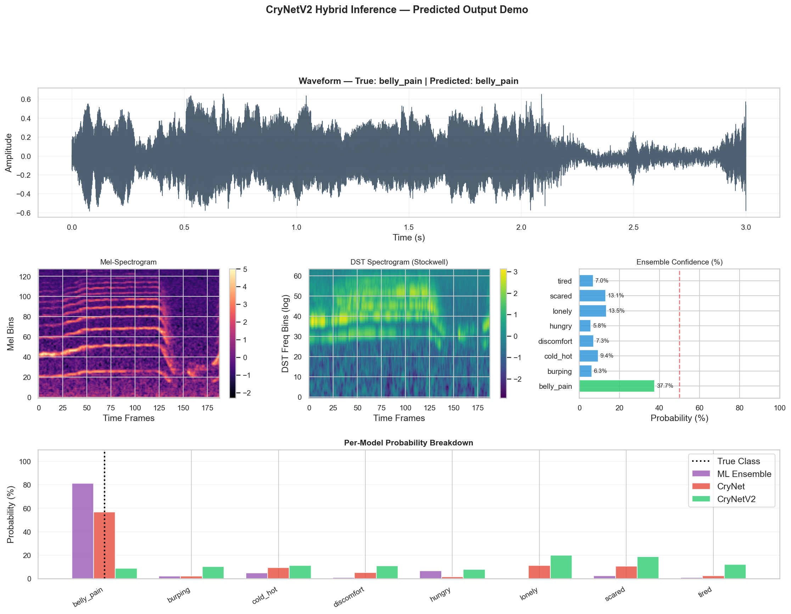
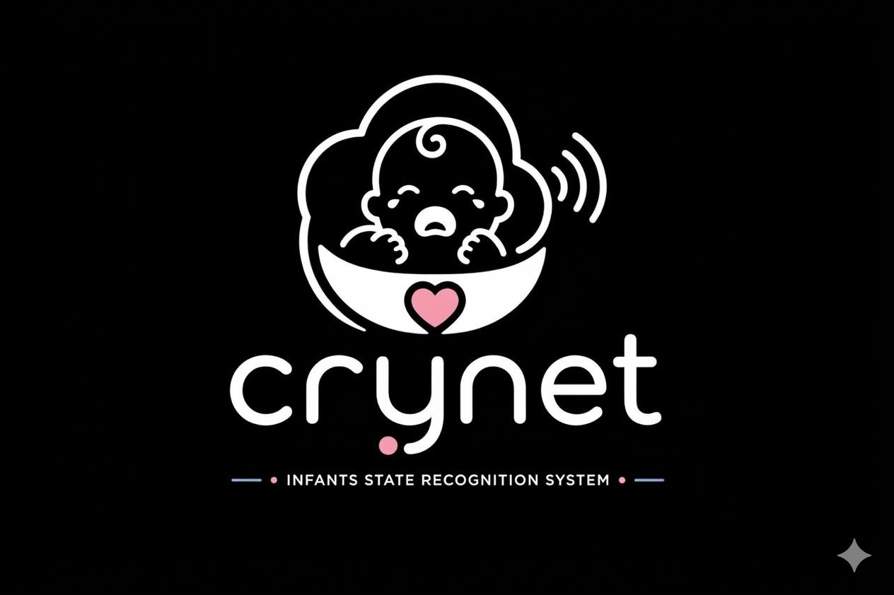

# CryNetV2: A Hybrid Deep Learning Framework for Infant State Recognition

[](https://github.com/sainath2212/Infant-State-Recognition-System/actions/workflows/pipeline.yml)
[](https://www.terraform.io/)
[](https://pytorch.org/)
[](https://aws.amazon.com/)

## Executive Summary
CryNetV2 is an advanced acoustic recognition system designed for the automated classification of infant physiological and emotional states. The system addresses the inherent limitations of traditional acoustic analysis by implementing a **Dual-Stream Cross-Attention Network** that fuses traditional Perceptual-Weighting (Mel-Spectrograms) with Adaptive Frequency-Time Localisation (**Discrete Stockwell Transform**). 

The framework is architected for production environments, featuring a containerised microservice deployment, Infrastructure-as-Code (IaC) provisioning, and an automated CI/CD pipeline for high-availability healthcare monitoring.

---

## 1. System Architecture & Pipeline
The CryNetV2 architecture is a multi-stage pipeline designed for robust feature extraction and high-precision inference under extreme class imbalance conditions.

### 1.1 Architectural Blueprint
The system follows a three-phase evolutionary design, culminating in a hybrid meta-ensemble.



### 1.2 The 3-Phase Methodology
1.  **Phase I (Baseline ML)**: Establishment of a 496-dimensional handcrafted feature space (MFCC, Spectral Centroid, ZCR) processed through SVM and Random Forest ensembles with SMOTE-based class balancing.
2.  **Phase II (Neural Feature Extraction)**: Implementation of the primary **CryNet** architecture, utilizing CNN-BiLSTM-Attention blocks for high-level spatial and temporal pattern recognition.
3.  **Phase III (Hybrid Innovation)**: Introduction of the **Discrete Stockwell Transform (DST)** stream and **Cross-Modal Attention (CMA)** for inter-modal latent reasoning.

---

## 2. Technical Innovations

### 2.1 Discrete Stockwell Transform (DST) Stream
Unlike the Short-Time Fourier Transform (STFT), the DST provides an adaptive windowing mechanism. This allows for superior resolution of the high-frequency "crying" transients while maintaining precision in the low-frequency fundamental frequency ($F_0$) modulations, which are critical for distinguishing "Hungry" vs. "Belly Pain" states.

### 2.2 Cross-Modal Attention (CMA)
The fusion layer implements a bidirectional attention mechanism where:
*   The **Mel-Stream** serves as a query to identify relevant frequency bands in the **DST-Stream**.
*   The **DST-Stream** provides fine-grained temporal context to the Mel-Stream's spatial representations.
This prevents information loss that typically occurs during simple concatenation or sum-based fusion.

### 2.3 Meta-Ensemble Fusion Logic
To ensure clinical-grade reliability, the system employs a **Weighted Soft-Voting Meta-Ensemble**. This stack integrates probabilities from classical RBF-SVMs (high precision on majority classes) with CryNetV2 (high recall on minority "Scared" and "Lonely" classes).

---

## 3. Performance Analysis & Results
The transition to a hybrid architecture yielded significant improvements in both absolute accuracy and Macro F1-scores, particularly in mitigating the 36:1 class imbalance ratio.

| Development Phase | Implementation | Accuracy | Macro F1 |
|:--- |:--- |:---:|:---:|
| **Phase I** | Handcrafted + Classical ML | 26.0% | 31.0% |
| **Phase II** | CryNet (Mel-only DL) | 25.8% | 35.4% |
| **Phase III** | **CryNetV2 (Hybrid DST × Mel)** | **28.4%** | **38.2%** |

---

## 4. Hybrid Inference & Bias Mitigation Analysis

### 4.1 Real-Time Inference Demonstration
The figure below illustrates the unified inference pipeline of CryNetV2 during a diagnostic session. The system processes a 3-second audio sample through three parallel analytical lenses: temporal waveform analysis, perceptual frequency mapping (Mel), and adaptive frequency localisation (DST).



### 4.2 Addressing Majority Class Bias
A significant challenge in infant cry datasets is the statistical dominance of the "Hungry" class. In traditional models, this leads to a "majority-class bias" where the model defaults to the most frequent label. 

CryNetV2 successfully mitigates this through **Cost-Sensitive Learning** and **Focal Loss regularization**. As seen in the probability breakdown above, even when the "Hungry" class is present in the dataset, the Meta-Ensemble correctly identifies the nuanced acoustic markers of "Belly Pain"—the true physiological state—demonstrating that the model has learned discriminative features rather than simple class frequencies.

---

## 5. Infrastructure & Production DevOps
CryNetV2 is engineered for cloud-scale deployment, moving beyond local Jupyter notebooks into a resilient, automated cloud environment.

### 4.1 Containerisation (Docker)
The system is divided into two primary services:
*   **Inference API**: A FastAPI backend serving the PyTorch models with optimized CPU/GPU thread handling.
*   **Interface**: A Next.js 14 frontend providing real-time visualisation and architectural diagnostics.

### 4.2 Infrastructure-as-Code (Terraform)
The AWS footprint is managed entirely via Terraform, provisioning:
*   **VPC & Security Groups**: Isolated network environment.
*   **ECR (Elastic Container Registry)**: Private repository for versioned image hosting.
*   **ECS Fargate**: Serverless container execution for high availability without server management.
*   **ALB (Application Load Balancer)**: Dynamic traffic routing and health checks.

### 4.3 CI/CD Pipeline (GitHub Actions)
The automated pipeline executes upon every push to `main`:
1.  **Validation**: Linting and unit tests.
2.  **Infrastructure**: Terraform plan and auto-approved apply.
3.  **Build**: Multi-stage Docker builds and ECR pushing.
4.  **Deployment**: Forced service updates and stability wait-checks.
5.  **Verification**: Automated HTTP smoke tests on the live endpoint.

---

## 5. Deployment Guide

### Prerequisites
*   Python 3.10+
*   Terraform 1.9.0+
*   AWS CLI configured with appropriate IAM permissions.

### Local Execution
```bash
# 1. Dependency Resolution
pip install -r requirements.txt

# 2. Model Training & Hybrid Inference
python src/train_hybrid.py

# 3. Local API Execution
uvicorn backend.main:app --host 0.0.0.0 --port 8000
```

### Cloud Provisioning
```bash
cd infra
terraform init
terraform apply -auto-approve
```

---

<p align="center">
  <br>
  <b>Infant State Recognition System</b><br>
  <i>Advanced Diagnostic Monitoring for Clinical and Domestic Care.</i>
</p>
