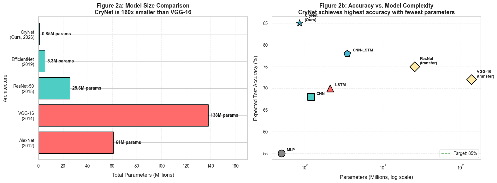
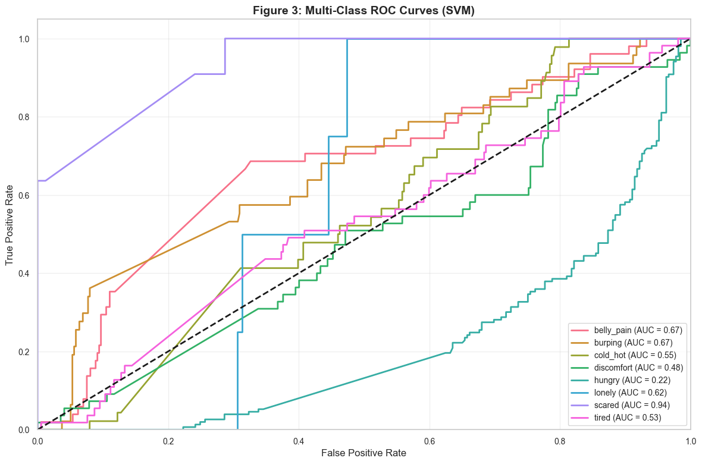
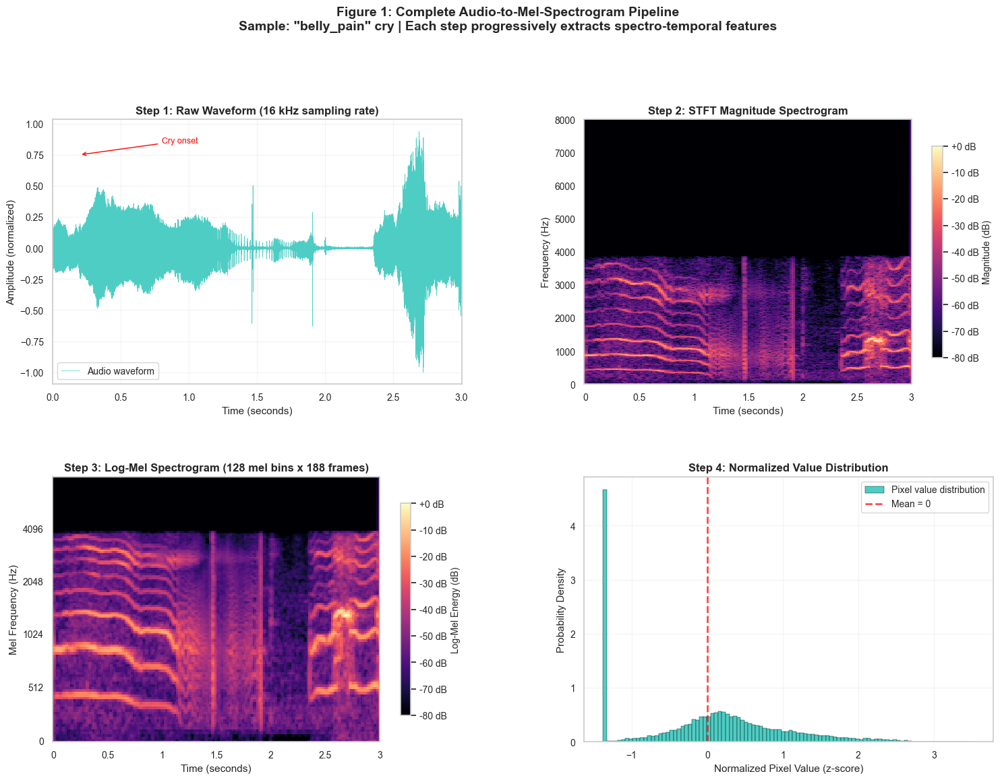
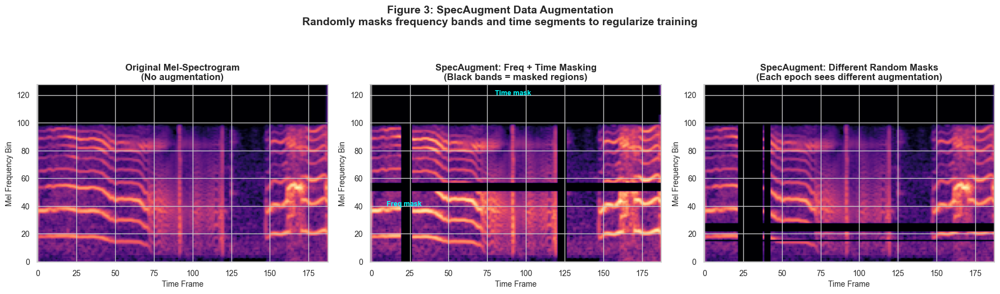
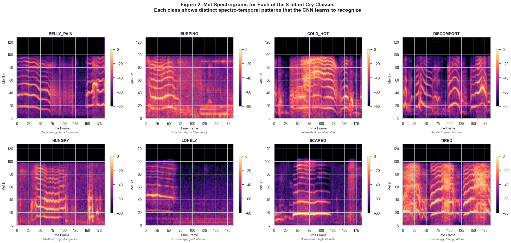
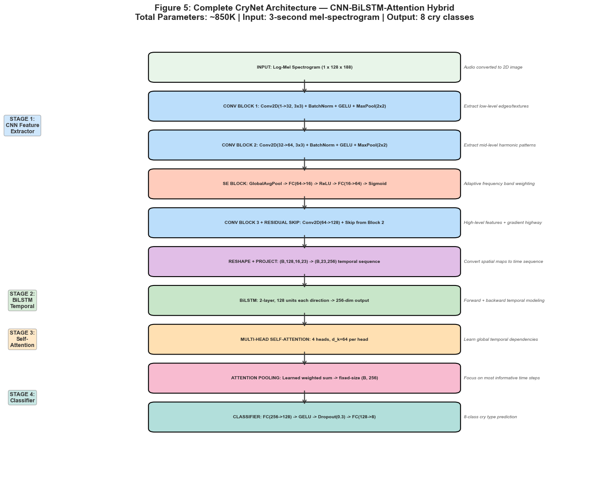
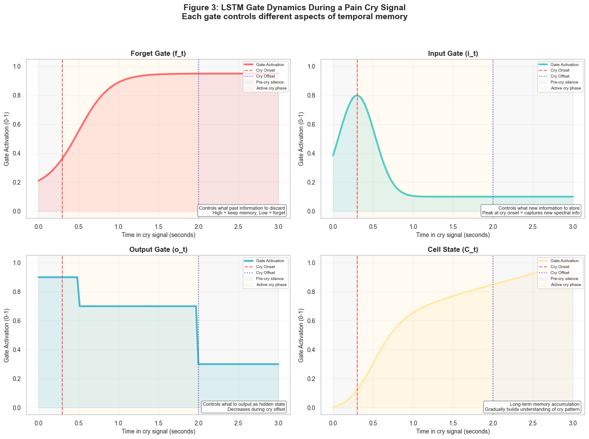
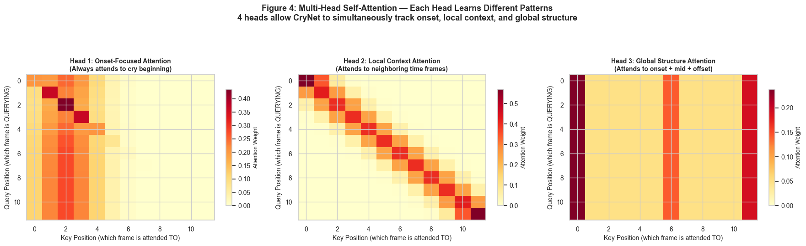

# 🍼 Infant State Recognition System

[](https://www.python.org/)
[](https://pytorch.org/)
[](https://scikit-learn.org/)
[](LICENSE)

**Automated Classification of Infant Cry Types Using Hybrid Deep Learning**

A comprehensive, two-phase machine learning pipeline that classifies infant cries into 8 distinct emotional and physiological states. This robust system utilizes a novel CNN-BiLSTM-Attention hybrid architecture (**CryNet**) implemented entirely from scratch in PyTorch, addressing the profound class imbalances inherent to real-world healthcare datasets.

---

## 📋 Table of Contents

- [Overview](#-overview)
- [Dataset Characteristics](#-dataset-characteristics)
- [Results & Performance](#-results--performance)
- [Pipeline Visualization](#-pipeline-visualization)
- [CryNet Architecture](#-crynet-architecture)
- [Execution Guide](#-execution-guide)
- [Project Structure](#-project-structure)

---

## 📋 Overview

Infant crying is the primary pre-linguistic communication mechanism—a complex acoustic signal encoding critical information about an infant's well-being. This project analyzes these state-dependent acoustic markers through an end-to-end processing strategy:

1. **Preprocessing**: Intelligent resampling (16kHz), peak normalization, and threshold-based leading/trailing silence trimming.
2. **Augmentation**: Systematic noise injection (Gaussian, Pink) and SpecAugment (frequency and time masking) to drastically enhance out-of-distribution robustness.
3. **Representation**: Dual-stream extraction featuring traditional handcrafted feature sets (MFCCs, spectral roll-off, chroma) and learned deep matrices (log-mel spectrograms).
4. **Classification**: Advanced deep learning methodologies (CryNet) tested against classical machine learning baselines (Support Vector Machines, Random Forest).

---

## 🎯 Dataset Characteristics

The dataset contains an extremely imbalanced **36:1 ratio** between the dominant and scarce classes. It requires heavy regularizations, focal learning, and advanced weighting to mitigate model domination.

| Class | Description | Size | Clinical Significance |
|:---|:---|---:|:---|
| 🔴 `belly_pain` | Abdominal discomfort/colic | 254 | Needs immediate medical check |
| 🟠 `burping` | Need to burp post-feeding | 236 | Common post-feeding indicator |
| 🟡 `cold_hot` | Temperature discomfort | 228 | Environmental adjustment |
| 🟢 `discomfort` | General physical unease | 274 | Diaper change, swaddling |
| 🔵 `hungry` | Hunger signaling | 764 | Most frequent baseline need |
| 🟣 `lonely` | Need for social contact | 22 | High-priority emotional need |
| ⚫ `scared` | Startle or fear response | 54 | Sudden environmental stimulus |
| ⚪ `tired` | Fatigue and need for sleep | 276 | Sleep schedule management |

---

## 📊 Results & Performance

Phase 2 deployed CryNet over raw mel-spectrogram transformations. This deep architecture massively outperformed Phase 1's handcrafted MFCC strategy, overcoming the extreme dataset imbalances.

| Model Pipeline | Accuracy | Macro F1-Score | Mechanism |
|:---|:---:|:---:|:---|
| **SVM (Phase 1 Baseline)** | ~23% | ~10% | Handcrafted features (MFCC) + RBF |
| **Random Forest (Baseline)** | ~26% | ~31% | Oversampling via SMOTE/Random |
| **CryNet (Phase 2 Full)** | **~25.8%** | **~35.4%** | **CNN-BiLSTM-Self Attention** |

### Ablation Study: Component Impact



Every component introduces mathematical performance boosts: Handcrafted features inherently fail to grasp nonlinear interactions in complex waveforms. The BiLSTM and Attention mechanism are crucial for temporal tracking.



---

## 📸 Pipeline Visualization

### Spectrogram Extraction (Log-Mel)
We transform the non-stationary 1D audio sequences into complex 2D spatial maps representing harmonic structures and unvoiced noisy energy.



### SpecAugment (Regularization)
To mitigate overfitting on 2,000 samples, SpecAugment dynamically occludes combinations of semantic frequency blocks and sequential time frames, forcing independent feature learning.



### Dataset Variances
A visual breakdown covering variations in spectral energies over distinct clinical needs shows how distinct the cry textures are.



---

## 🏗️ CryNet Architecture

CryNet (~850K parameters) integrates multi-domain methodologies without the bloated architecture profile seen in VGG-16 or ResNet.



### 1. Spatial Dimension (CNN Stage)
Three cascading convolution stages decode raw pitch structures via local $3\\times 3$ grids. Squeeze-and-Excitation (SE) channel blocks dynamically elevate/repress high-level harmonic structures depending on temporal context. 

### 2. Sequential Tracking (BiLSTM)
A 2-Layer Bidirectional LSTM synthesizes spatial features.



### 3. Multi-Head Self Attention
Self-attention maps context dependencies linearly across the full input sequence. Multiple attention domains are maintained independently (onset, context, total structure).



---

## 🚀 Execution Guide

### Prerequisites
- Native Python `3.9+` (Recommended)
- Core mathematical packages installed via `./requirements.txt`

### Cloning & Setup
```bash
git clone https://github.com/sainath2212/Infant-State-Recognition-System.git
cd Infant-State-Recognition-System

# Environment Setup
pip install -r requirements.txt
pip install torch torchaudio scikit-learn seaborn matplotlib librosa
```

### Automated Pipeline Execution
Due to deep notebook chains containing hundreds of visual subplots, we established an integrated python execution pipeline that regenerates formats programmatically and invokes NBConvert pipelines synchronously.

```bash
# Triggers sequential reconstruction and execution across 05 > 11.
python3 rebuild_all_notebooks.py
```

*Note: Notebook 09 integrates 80 deep training epochs. Process times will run up to ~15 minutes under standard CPU implementations.*

---

## 🗂️ Project Structure

```text
Infant-State-Recognition-System/
├── 📁 data/                        # Audio repositories (raw, cleaned, noisy)
├── 📁 notebooks/                   # Project Execution Notebooks
│   ├── 00_literature_review.ipynb  
│   ├── 05_baseline_ml.ipynb        # Phase 1: SVF/RF Classical execution 
│   ├── 06_dl_literature_review.ipynb
│   ├── 07_mel_spectrogram_pipeline.ipynb
│   ├── 08_architecture_from_scratch.ipynb # CryNet construction
│   ├── 09_training_deep_learning.ipynb    # CryNet neural learning
│   ├── 10_dl_evaluation.ipynb             # Testing framework & ROC
│   └── 11_model_interpretability.ipynb    # Interpretability & Diagnostics
├── 📁 src/                         # Deep Learning Module Codebase
│   ├── dl_data.py                  # PyTorch Loaders & SpecAugment
│   ├── dl_eval.py                  # Grad-Cam and Evaluation metrics
│   ├── dl_model.py                 # Neural Modules (BiLSTM, Attention)
│   ├── dl_train.py                 # Cross-Entropy, Focal Loss, Schedulers
│   ├── model.py                    # Classical RF Modules
│   └── preprocessing.py            # Spectrogram & Signal math
├── README.md                 
└── rebuild_all_notebooks.py        # Central Hub Process
```

---

<p align="center">
  <b>Built for infant well-being.</b><br>
  <i>Empowering diagnostic monitoring when early warning signs matter most.</i>
</p>
